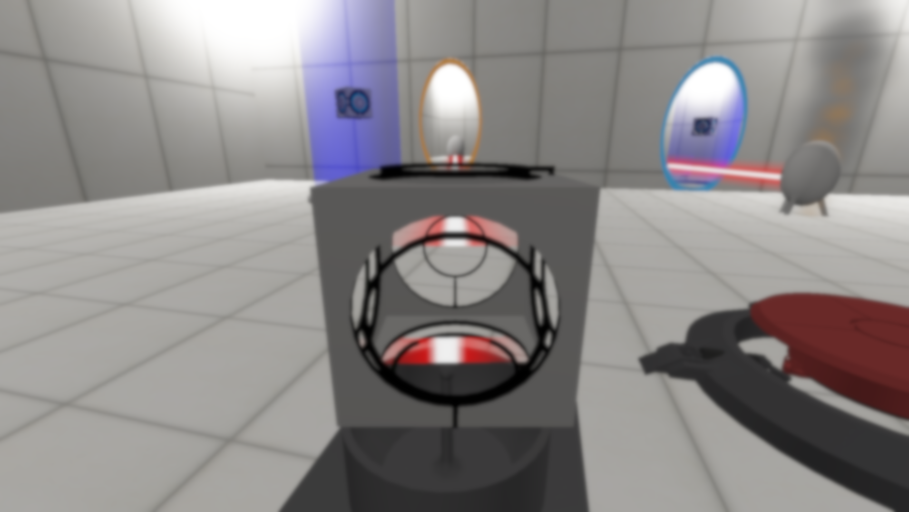

	

		
		

			A New Portal Game 
			Valve is amazing, and they release amazing games, but sometimes we wish they would reconsider their policy on the number 3 being a myth. This game is aimed at being an unofficial, community-made sequel for Portal 2.
			  
			To see our progress, check out our Updates!
		

	

